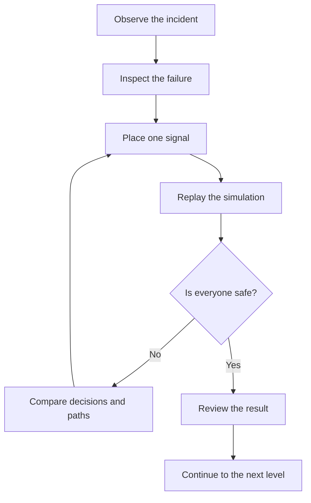

# BEFORE THE SMOKE — 10-Level Mechanical Prototype Specification

**Platform:** iOS only
**Technology:** React Native CLI 0.87, TypeScript, fully offline
**Prototype purpose:** Determine whether changing the outcome of a deterministic evacuation incident by placing exactly one directional signal is understandable, satisfying, and replayable enough to support a complete game.

> Every number in §9 is produced by the level data in `src/game/levels/` and
> verified on each test run by the harness in §15. If a number here disagrees
> with the code, the code is right and this document is stale.

---

## 1. The one-sentence promise

> Watch a ten-second failure, place one signal, and change everything that follows.

The player never moves people directly. Each person walks, makes decisions, follows others, and reacts to danger according to a small set of visible behavioural rules. The player's power is deliberately limited: before the incident is replayed, they may place **one directional signal at one junction**.

That limitation is the identity of the game. The first prototype contains no door controls, alarms, lights, second signal, power-up, or intervention during the simulation.

---

## 2. Design hypothesis

The prototype tests five assumptions:

1. While watching the failed simulation, players will naturally try to diagnose the problem.
2. A single intervention will turn a simple drag-and-drop action into a meaningful decision.
3. Watching the same initial situation reach a different outcome will create a strong sense of causality and control.
4. When failure is legible, players will attribute it to their decision rather than to arbitrary game behaviour.
5. A 20–60 second attempt loop will encourage an immediate "one more try".

A successful prototype is not one with many features. By the end of the tenth level, the player should be able to say:

> I am not controlling the crowd. I am influencing the right person, at the right place, early enough.

---

## 3. Core gameplay loop



### 3.1 First visit to a level

1. The level opens paused, with the full map visible.
2. A short prompt appears: `WATCH THE INCIDENT`.
3. A tap starts the baseline simulation with no player intervention.
4. The simulation runs to its conclusion and then freezes on the failure frame.
5. The failed person's final path appears as a dashed trail with a hazard icon.
6. Signal sockets become visible at eligible junctions.
7. The player drags their single signal from the bottom tray to a socket.
8. Tapping the signal rotates it through valid outgoing directions.
9. `REPLAY` restarts the incident with the exact same initial conditions.
10. The signal is the only changed variable.

### 3.2 Later attempts

- The baseline run is not forced again.
- `BEFORE` displays baseline paths as translucent trails.
- After failure, the signal remains in place and can be moved or rotated.
- Restart transition must take less than 400 ms.
- Results appear in a bottom sheet rather than a blocking full-screen summary.

---

## 4. Invariant rules

### 4.1 The single signal

- Every level gives the player exactly one signal.
- It can only be placed in predefined **signal sockets**.
- Each socket belongs to a decision node, or junction.
- The arrow can only point along a physically valid outgoing edge.
- The signal is active from tick zero and cannot be changed during a run.
- It does not attract distant people. It affects a person only when they reach its junction.
- It cannot send a person down a corridor that is blocked at the moment they decide.
- The signal does not predict future danger. The player can make a better decision only because they observed the baseline incident.

### 4.2 Determinism

The following remain identical on every attempt:

- Spawn positions, **scheduled** times, and order
- Walking speeds
- Hazard start and spread times
- Door closures and corridor blockages
- Character preferences
- Conflict-resolution results when agents request the same tile
- The order in which agents make route decisions within a tick

The first ten levels contain no randomness. The same signal in the same socket and direction always produces the same outcome, and the determinism test in §15 asserts it byte for byte.

Note the word *scheduled*. A person whose spawn tile is occupied enters on the first free tick instead, so a level may schedule several people at once without breaking cell capacity. The schedule is invariant; the resolved entry tick is derived from it deterministically.

### 4.3 Win condition

A level is complete only when every person reaches a safe exit. The prototype does not use a "save enough people" threshold; otherwise sacrificing the slowest or most difficult person could become a normal solution.

Three independent performance marks are shown:

| Mark | Requirement |
|---|---|
| Rescue | Everyone reaches an exit |
| Flow | Total waiting time stays at or below `maxWaitTicksForFlow` |
| Swift | The final person exits at or before `parFinishTick` |

Only `Rescue` is required to unlock the next level. Both other thresholds are set from the intended solution's own measured run, and the harness fails the build if either becomes unreachable.

---

## 5. Simulation model

### 5.1 Time

- Fixed simulation step: `SIM_TICK_MS = 250`.
- A normal character moves one tile per eligible simulation tick.
- Visual movement interpolates for approximately 220 ms, leaving a short visual pause before the next decision.
- Rendering may run at the display's refresh rate, but game logic never depends on frame rate.
- Backgrounding the app pauses the simulation at its current tick.

Tick 0 is the opening frame: events scheduled at `t=0` have fired and everyone scheduled at `t=0` is standing on their spawn tile. The first step is `t=1`, so an edge documented as `[3]` really does put a person on the far node at `t=3`. Someone entering later stands on their spawn tile for one tick before walking, exactly as the people placed at `t=0` do.

### 5.2 Map structure

The game uses a fixed, top-down portrait map that fits on one screen (13 × 20 cells). There is no camera pan or zoom.

Logic uses two connected layers:

1. **Navigation graph:** nodes, corridors, exits, path costs, and signal decisions. This is what levels are authored in.
2. **Grid:** walls, floors, doors, smoke, occupancy, and collisions. This is **derived** from the graph — every cell named by a node or an edge is walkable, everything else is wall.

Deriving the grid rather than authoring it keeps one source of truth: a corridor cannot exist on screen without existing in the graph, and an edge's documented `[n]` cost cannot drift from its drawn length.

Each edge carries the exact sequence of cells a person occupies on successive ticks, ending on the destination node's cell — so `cells.length` *is* the travel cost in ticks.

### 5.3 Tile types

| Type | Behaviour |
|---|---|
| `FLOOR` | Walkable; capacity 1 |
| `WALL` | Not walkable |
| `EXIT` | Changes a person to the safe state |
| `DOOR` | Capacity 1 when open; may close through an event |

Smoke is per-cell dynamic state, not a tile type. Junctions are graph nodes, not tiles. Sockets are their own definition list, not tiles. Each of these was represented twice in the original specification with no rule for reconciling the two representations.

There is no `FIRE` tile and no `ADD_FIRE` event: no level in the prototype uses fire, so both would be untested code and untested art.

### 5.4 Smoke and exposure

- A person gains 1 exposure for every tick ended on a smoke cell.
- At `exposure >= 4` the person is incapacitated and the run has failed.
- Exposure does not decrease after leaving smoke during the same run.
- Smoke must remain translucent enough for the underlying route to be readable.

**Why four.** At 4 Hz the original cap of 3 was 750 ms, which made any three-cell smoke zone an impassable wall and contradicted the soft `smoke × 10` route cost that treats smoke as a penalty rather than a barrier. Four is the value the geometry actually wants:

- A **two-cell** zone costs a Navigator 2 and a Slow person 4, because the Slow person stands on each cell twice. The same corridor is survivable for four people and lethal for the fifth — that is Level 8 in one sentence.
- A **four-cell** zone that lands ahead of someone already committed to the corridor is lethal to anyone — that is Level 4.
- Someone **stalled** in a two- or three-cell zone by a queue in front of them dies where a free-flowing person would not — that is Levels 6 and 10.

A useful consequence to keep in mind when authoring: smoke can only kill a walking person if the smoky stretch *ahead* of them is at least four cells. Anything shorter kills only people who are waiting.

### 5.5 Movement and collision resolution

Each tick runs in this order:

1. Apply scheduled world events.
2. Release spawns (FIFO per spawn node, ascending spawn order, one per free cell).
3. Resolve route decisions, **in ascending spawn order**.
4. Ask every eligible person for a target cell.
5. Resolve competing requests.
6. Commit winning moves simultaneously.
7. Apply smoke exposure and exit checks.
8. Check win, failure, and deadlock conditions.

Step 3's ordering is load-bearing, not a detail. A Follower reads the edge a leader has *committed to*, so if agents decided in arbitrary order it would be undefined whether a Follower saw a decision made in the same tick — and the determinism guarantee in §4.2 would be false. Ascending spawn order fixes it: a Follower may copy a decision made earlier this tick or before, never one made later.

When several people request the same cell, priority is:

1. Most accumulated wait ticks
2. Earliest arrival on their current cell
3. Lower spawn order

Moves are resolved to a fixpoint, so a person may enter a cell being vacated in the same tick. Two people facing each other can never both be granted, because each is waiting on the other — which produces the head-on deadlock of Level 7 with no special case in the code.

### 5.6 Default route calculation

People do not know future hazard events. They choose using the world state visible at the moment they decide.

```text
routeCost = remainingTravelTicks
          + smokeCells × 10
          + stalledPeopleAhead × 2
```

Two clarifications the original left open:

- **Scope.** The travel and smoke terms are evaluated over the *whole remaining route to an exit* (Dijkstra backwards from every exit), not just the next edge. Otherwise a person at a junction cannot tell a short branch that dead-ends from a short branch that does not.
- **Queue.** The queue term is local perception only, applied to the candidate edge alone, counting people on its first four cells **who were blocked on the previous tick**. A line of people walking at full speed is not congestion. Counting them made one person walking ahead of you flip a route choice — precisely the "perfect evacuation optimiser" behaviour the design is trying to avoid.

Further rules:

- A route containing a closed door or a blocked edge cannot be selected.
- Smoke that has not appeared yet has no cost.
- The lowest-cost known exit is selected by default.
- Ties are broken by the order the edges are declared on the node — a fixed, level-authored priority, never random.
- Once a person enters a corridor they stay committed until the next junction.

---

## 6. Character types

### 6.1 Navigator

The standard character.

1. Reject blocked directions.
2. Follow the player's signal if one exists at this junction.
3. Otherwise choose the lowest currently perceived route cost.

### 6.2 Follower

Prefers copying a nearby committed person. Visual identifier: paired footprints.

1. Reject a blocked direction.
2. If an eligible leader is visible, take whichever of *this* junction's corridors heads the same way.
3. If no leader is eligible, follow this junction's signal.
4. Otherwise behave like a Navigator.

**Visibility** is defined as within three cells by breadth-first search over walkable cells — so walls occlude and distance is not Euclidean. There is no smoke occlusion: the prototype has no visibility system, and the visual design must not imply one.

**Copying is by direction, not by edge id.** A Follower takes whichever of its own corridors leads where the visible leader is heading. This is what lets a leader who never passes the Follower's junction still turn the group (Level 9), and what lets one converted Follower convert the next one behind it.

Leader selection priority:

1. The person this Follower already copied, if still visible
2. The nearest visible Navigator
3. The nearest other visible person
4. Lower spawn order

### 6.3 Slow

Uses the Navigator decision rules but banks one movement credit per tick and spends two to move — integer arithmetic, because bit-identical replay is a headline requirement and there is no reason to put a float in the tick path. Effective speed is half normal.

The visual treatment must be calm and humane. The mechanic is not about treating this person as a burden; it demonstrates that saving the majority does not mean the system is safe.

---

## 7. Signal decision algorithm

```ts
function chooseNextEdge(agent, junction, world): Decision {
  const safeEdges = junction.outgoingEdges.filter(
    edge => !world.isBlocked(edge),
  );

  if (agent.type === 'FOLLOWER') {
    const leader = findEligibleLeader(agent, junction, world);
    if (leader) {
      // Match the leader's committed edge, or failing that any edge of our own
      // that ends where theirs does.
      const copied =
        safeEdges.find(e => e.id === leader.committedNextEdgeId) ??
        safeEdges.find(e => e.to === world.edge(leader.committedNextEdgeId).to);
      if (copied) {
        return {edge: copied, reason: 'FOLLOWED_AGENT', leaderId: leader.id};
      }
    }
  }

  const signalEdgeId =
    world.activeSignal?.junctionId === junction.id
      ? world.activeSignal.edgeId
      : undefined;

  const signalled = safeEdges.find(e => e.id === signalEdgeId);
  if (signalled) {
    return {edge: signalled, reason: 'FOLLOWED_SIGNAL'};
  }

  return {
    edge: findLowestPerceivedCostEdge(agent, safeEdges, world),
    reason: 'NEAREST_SAFE_EXIT',
  };
}
```

Every decision at a junction produces a log entry:

```ts
type DecisionReason =
  | 'FOLLOWED_SIGNAL'
  | 'FOLLOWED_AGENT'
  | 'NEAREST_SAFE_EXIT'
  | 'NO_AVAILABLE_ROUTE';

interface DecisionLogEntry {
  tick: number;
  agentId: string;
  junctionId: string;
  chosenEdgeId?: string;
  reason: DecisionReason;
  followedAgentId?: string;
}
```

These logs power both developer diagnostics and the player's post-failure explanation.

---

## 8. Explaining failure

A result such as `3/5 SAFE` is not enough. If players cannot understand the agent system they will consider it unfair.

### 8.1 When a run ends

The engine ends a run for exactly one of four reasons, each of which maps to one sentence the player can read:

| `failureReason` | Player-facing cause |
|---|---|
| `NO_AVAILABLE_ROUTE` | `The way out closed while they were still in the corridor.` |
| `SMOKE_EXPOSURE` | `Smoke exposure reached the limit.` |
| `COUNTERFLOW_DEADLOCK` | `Could not move against the opposing flow.` |
| `TIME_LIMIT` | `The building did not clear in time.` |

`NO_AVAILABLE_ROUTE` fires the moment someone can no longer reach any exit — either standing at a node with no route or committed to a corridor that is now blocked ahead of them. `COUNTERFLOW_DEADLOCK` fires when nobody is left to arrive and nobody has moved for six ticks; because doors only ever close and smoke only ever spreads, no pending event can free a standstill, so waiting would only report the eventual smoke instead of the counterflow that actually caused it. Every level also carries a `maxTicks` cap, which guarantees termination.

### 8.2 Naming the decision that caused it

The original specification asked the analysis view to pause at "the earliest irreversible failure" and highlight "the responsible decision point, not merely the final victim". That is a counterfactual root-cause analysis, and the engine cannot derive it: the moment someone becomes doomed is usually many ticks after the junction where it was decided.

The prototype therefore **authors** it. Each level declares a `criticalDecision` naming the junction the analysis view blames, and the `DecisionLog` supplies the tick and the reason for that person's choice there. This is honest about what the system knows, costs one field per level, and produces a better explanation than any heuristic would.

### 8.3 Presentation

- Show the failed person's final eight cells as a dashed trail. When someone failed while stationary — a deadlock, or waiting at a shut door — show the stall as a pulsing marker instead, since the trail would be one cell repeated.
- Pulse the `criticalDecision` junction.
- Tapping a person shows the one-line reason from §8.1.
- `BEFORE / AFTER` compares baseline and latest paths.
- Do not immediately highlight the correct socket.
- After two failures, an optional hint may reveal the critical decision moment without revealing the solution.

---

## 9. Ten-level prototype

Numbers in square brackets are travel costs in ticks for a normal character. Event times count from simulation start. Every row below is validated on each test run.

### Level 1 — Wrong Corridor

**Teaches:** placing, rotating and testing the signal.

| Element | Definition |
|---|---|
| People | 1 Navigator at `t=0` |
| Routes | `S1 → J1 [3]`; `J1 → E1 [5]`; `J1 → E2 [7]` |
| Default | E1 is two ticks shorter |
| Event | The door in the E1 corridor closes at `t=7` |
| Sockets | J1 only |
| Baseline | `0/1` — stranded at the closed door, `NO_AVAILABLE_ROUTE` |
| Solution | `J1 → E2`, everyone out at `t=10` |

There is no junction between J1 and E1, so the person cannot turn around. Only one socket is exposed, so the player learns the interaction without also solving a placement puzzle.

**Target first-attempt success:** above 90%.

### Level 2 — One Arrow, Five People

**Teaches:** one signal moves a whole group, and a queue makes the group long.

| Element | Definition |
|---|---|
| People | 5 Navigators, 3 from SA and 2 from SB, all scheduled `t=0` |
| Routes | `SA → M [2]`; `SB → M [2]`; `M → J1 [2]`; `J1 → E1 [5]`; `J1 → E2 [8]` |
| Default | Everyone takes the shorter E1 |
| Event | The E1 door closes at `t=11` |
| Sockets | J1 |
| Baseline | `3/5` — the tail of the group is still in the corridor |
| Solution | `J1 → E2`, everyone out at `t=16` |

Two waiting areas feeding one corridor is what creates the queue. A single spawn tile cannot: people released one per tick into a corridor that carries one tile per tick travel as an evenly spaced train and never contend for anything. The original level's stated cause — queue-driven exposure from one spawn point — was unreachable for exactly this reason.

### Level 3 — Too Late

**Teaches:** where you intervene matters as much as which way you point.

| Element | Definition |
|---|---|
| People | 3 Navigators at `t=0` |
| Routes | `S → J1 [2]`; `J1 → J2 [3]`; `J2 → E1 [3]`; `J1 → E2 [8]`; `J2 → B1 [3]`; `B1 → E2 [2]` |
| Events | The bridge `J2 → B1` blocks at `t=7`; the E1 door closes at `t=8` |
| Sockets | J1 and J2 |
| Baseline | `1/3` |
| Solution | `J1 → E2`, everyone out at `t=14` |
| Trap | `J2 → B1` — `0/3`, worse than doing nothing |

There is a real escape at J2, and it shuts while the group is still walking towards it. The lesson shifts from putting a sign beside the danger to changing the decision before it.

### Level 4 — Safe for Now

**Teaches:** people cannot see the hazard coming; only the observer can.

| Element | Definition |
|---|---|
| People | 4 Navigators at `t=0` |
| Routes | `S → J1 [3]`; `J1 → J2 [3]`; `J2 → E1 [5]`; `J2 → E3 [7]`; `J1 → E2 [9]` |
| Initial state | Every route is clear when everyone decides |
| Events | The E3 spur closes at `t=8`; smoke fills four cells of the E1 corridor at `t=10` |
| Sockets | J1 and J2 |
| Baseline | `2/4` — the last person is inside the corridor when the smoke lands |
| Solution | `J1 → E2`, everyone out at `t=18` |
| Trap | `J2 → E3` — the escape beside the corridor has already shut |

From this level onwards the analysis view includes a compact event strip for observed doors and smoke.

### Level 5 — Turn the Leader

**Teaches:** Followers copy a visible person, so one person is worth six.

| Element | Definition |
|---|---|
| People | 1 Navigator leader and 6 Followers, all scheduled `t=0` |
| Routes | `S → J1 [3]`; `J1 → J2 [3]`; `J2 → E1 [4]`; `J2 → E3 [7]`; `J1 → E2 [8]` |
| Default | The leader takes the short branch; the Followers copy |
| Events | The E3 spur closes at `t=6`; the E1 door closes at `t=12` |
| Sockets | J1 and J2 |
| Baseline | `2/7` |
| Solution | `J1 → E2`, everyone out at `t=23` |
| Trap | `J2 → E3` |

The decision trails visibly connect the Followers to the leader. One signal then changes the behaviour of all seven people. Level 5 shares the *shape* of Level 4's trap deliberately: the new information here is the Follower, not the trap.

### Level 6 — Bottleneck

**Teaches:** capacity, merge points, and more than one right answer.

| Element | Definition |
|---|---|
| Group A | 3 Navigators from SA at `t=0` |
| Group B | 5 Navigators from SB at `t=0` |
| Routes | `SA → JA [2]`; `SB → JB [2]`; `JA → M1 [5]`; `JB → M1 [5]`; `M1 → E1 [4]` through a one-tile door |
| Alternatives | `JA → E2 [10]` and `JB → E3 [10]` |
| Event | Smoke reaches the merge and the doorway at `t=7` |
| Sockets | JA and JB |
| Baseline | `1/8` — the queue is standing in the smoke |
| Solutions | `JA → E2` **or** `JB → E3`, both finishing at `t=20` |

The first level with two valid answers. The queue is not a consequence of the hazard; it is the hazard.

### Level 7 — Opposing Flow

**Teaches:** two individually sensible decisions can lock the whole system.

| Element | Definition |
|---|---|
| People | 4 Navigators at `t=0` |
| Routes | `SA → JW [3]`; `JW → JX [5]`; `JX → EW [1]`; `JX → JW [5]`; `JW → JE [6]`; `JE → EE [3]` |
| Default | Everyone takes the near western exit; it is shortest for each of them |
| Event | The western exit closes at `t=12` |
| Sockets | JW and JX |
| Baseline | `2/4`, `COUNTERFLOW_DEADLOCK` |
| Solution | `JW → JE`, everyone out at `t=18` |
| Trap | `JX → JW` — turning them round only starts the collision sooner |

The people who have reached JX turn back and walk into the people still coming, in a corridor one tile wide where nobody may swap. Nobody moves again.

**A note on the construction.** Under a nearest-exit rule, two groups on a symmetric map never produce head-on counterflow: each group always prefers the exit on its own side, so they never enter the shared corridor in opposite directions. Making them do so requires either an asymmetry that the cost function immediately undoes, or per-group goals the engine does not have. A reverse flow after a closure is what this model genuinely produces, and it teaches the same lesson. The exit tile itself is the door, so people are turned away while still standing on the junction rather than stranded halfway down a corridor.

### Level 8 — The Last Person

**Teaches:** judge the route against the slowest person, not the fastest.

| Element | Definition |
|---|---|
| People | 4 Navigators and 1 Slow, all at `t=0` |
| Routes | `S → J1 [2]`; `J1 → J2 [3]`; `J2 → E1 [3]`; `J2 → E4 [6]`; `J1 → E2 [7]` |
| Events | The E4 spur closes at `t=14`; two cells of the E1 corridor fill with smoke at `t=16` |
| Sockets | J1 and J2 |
| Baseline | `4/5` — the four Navigators leave, the Slow person does not |
| Solution | `J1 → E2`, everyone out at `t=26` |
| Trap | `J2 → E4` — open for the Navigators, shut by the time the Slow person arrives |

Two smoke cells cost a Navigator 2 exposure and a Slow person 4, because they stand on each cell twice. E2 is slightly longer and never closes.

### Level 9 — The Unseen Effect

**Teaches:** one turned leader converts a group that never reads the sign.

| Element | Definition |
|---|---|
| Leader | 1 Navigator from SA at `t=0` |
| Group | 5 Followers from SB at `t=5` |
| Routes | `SA → J1 [3]`; `SB → J2 [4]`; `J1 → E1 [9]`; `J1 → E2 [10]`; `J2 → E1 [4]`; `J2 → E2 [5]` |
| Event | The E1 exit door closes at `t=12` |
| Sockets | J1 and J2 |
| Baseline | `0/6` |
| Solution | `J1 → E2`, everyone out at `t=22` |
| Trap | `J2 → E2` — saves the group and loses the leader |

The socket at J1 is on the leader's route only; the Follower group never passes it. Turning the leader east sends them walking two cells south of J2 exactly as the group arrives there. The first Follower copies the leader, and each Follower after that copies the one in front. After success, a brief connection animation appears over the Followers who changed direction without reading anything themselves.

### Level 10 — Before the Smoke

**Teaches:** find the cause, not the symptom.

| Element | Definition |
|---|---|
| Group A | 1 Navigator leader and 4 Followers from SA at `t=6` |
| Group B | 1 Slow and 3 Navigators from SB at `t=0` |
| Routes | `SA → J1 [3]`; `SB → J2 [3]`; `J1 → J3 [5]`; `J2 → J3 [5]`; `J3 → E1 [4]` through a one-tile door |
| Alternatives | `J1 → E2 [10]`; `J2 → E3 [10]`; `J3 → E4 [10]` |
| Events | Smoke reaches the merge at `t=18`; the E3 route closes at `t=20` |
| Sockets | J1, J2 and J3 |
| Baseline | `2/9` |
| Solution | `J1 → E2`, everyone out at `t=26` |
| Traps | `J3 → E4` too late; `J2 → E3` too long for the Slow person before it shuts |

The chain the player has to see:

1. The visible failure is smoke exposure.
2. The exposure comes from waiting at the merge.
3. The waiting comes from two flows arriving at one doorway.
4. The highest-leverage intervention is not at the doorway but at J1, where the larger group can be redirected socially.
5. Turning the leader also turns four Followers.
6. The central route then has enough capacity for group B and the Slow person.

The reward is not stopping the hazard. It is finding and changing the system's cause before the smoke arrives.

---

## 10. Learning curve

| Level | New information | Reused knowledge |
|---:|---|---|
| 1 | Signal interaction | — |
| 2 | Group flow and queues | One signal |
| 3 | Intervention location | Direction and position |
| 4 | Future hazard | Observation and early decision |
| 5 | Followers | Influence the right person |
| 6 | Bottleneck, two valid answers | Split flows |
| 7 | Counterflow | Manage capacity through direction |
| 8 | Slow character | Protect the slowest participant |
| 9 | Social chain | Early position and Followers |
| 10 | Root cause | Combine every system |

New mechanics appear visibly in the baseline incident first. The analysis view then explains the decision; menu text should not carry the teaching burden.

---

## 11. Screens and interaction

### 11.1 Level selection

Ten floor-plan cards along a vertical route, showing `Rescue`, `Flow` and `Swift` once earned. A level unlocks when the previous one earns `Rescue`. No currency, lives, energy, or daily reward.

### 11.2 Game screen

Top: level number and title, safe count, tick counter, pause and mute.

Centre: the full map, people, hazards, signal and sockets, decision indicators and comparison trails.

Bottom, by phase:

- Observation: speed and pause
- Analysis: signal tray, `BEFORE`, event strip
- Preparation: active signal, rotate, `REPLAY`
- Result: safe count, cause, retry or next

### 11.3 Signal interaction

1. Drag the signal from the tray.
2. Eligible sockets enlarge; invalid areas do not react.
3. Snapping engages within 32 pt, to the **nearest** eligible socket rather than the first one found.
4. Give a light haptic confirmation.
5. Each tap rotates through valid outgoing directions.
6. The first three cells of the indicated edge briefly receive an amber outline.
7. Do not preview the complete future path; the player must predict the consequence.

Socket anchors are stored as grid coordinates and converted to screen position at layout time. Storing screen coordinates in level data would bake one device's pixel geometry into content that has to survive several screen sizes and Dynamic Type.

---

## 12. Architecture

### 12.1 Separate the engine from React

- `SimulationEngine` is a mutable, framework-independent TypeScript class under `src/game/engine/`. It imports no React and no timers, so it runs headless under Jest.
- It owns the fixed-tick authoritative state.
- Rendering reads a read-only `FrameSnapshot` per tick.
- Menus, overlays and phase changes use React state.
- People, hazards and trails draw in one canvas rather than many nested React components.

```text
src/
  game/
    engine/          # SimulationEngine, WorldMap
    behavior/        # Navigator, Follower, Slow decisions
    pathfinding/     # navigation graph and perceived cost
    levels/          # 10 static LevelDefinition objects + the validation harness
    replay/          # snapshots and DecisionLog
  rendering/
    GameCanvas.tsx
    layers/          # floor, hazards, people, signal, overlays
  screens/
    LevelSelectScreen.tsx
    GameScreen.tsx
  storage/
  audio/
  components/
  state/
```

### 12.2 Dependencies

The project is on **React Native 0.87.1 / React 19.2.3**, new architecture only.

| Need | Choice | Note |
|---|---|---|
| 2D rendering | `@shopify/react-native-skia` | Earns its place: canvas, smoke noise, trails |
| Touch | `react-native-gesture-handler` | Required for the socket drag over a Skia canvas; unlisted in the original spec |
| Haptics | a haptics module | RN ships no haptics API; the design specifies six patterns |
| Persistence | MMKV, or a JSON file | See below |
| Panel transitions | core `Animated` | **Not** Reanimated |

**Not SQLite.** The persisted data is ten progress rows and a run log, and it is written after a run, never inside the loop. A JSI SQLite binding is the single most likely thing to break this build: it couples to native module versions, and `react-native-nitro-sqlite`'s "RN ≥ 0.75" guidance is stale against 0.87 new-architecture-only. If SQLite is ever genuinely needed, `op-sqlite` is the better-maintained line.

**Not Reanimated.** It was proposed only for panels and transitions, which core `Animated` covers without a Babel plugin and worklets.

Keep the record shapes below as the logical persistence format regardless of the store:

```ts
interface LevelProgress {
  levelId: string;
  unlocked: boolean;
  completed: boolean;
  bestFinishTick: number | null;
  bestWaitTicks: number | null;
  attemptCount: number;
  completedAt: string | null;
}

interface RunRecord {
  levelId: string;
  attemptNo: number;
  signalSocketId: string | null;
  signalEdgeId: string | null;
  savedCount: number;
  totalCount: number;
  finishTick: number | null;
  totalWaitTicks: number;
  totalExposure: number;
  failureReason: FailureReason | null;
  createdAt: string;
}
```

### 12.3 Level definition

```ts
interface LevelDefinition {
  id: string;
  title: string;
  teaches: string;
  width: number;
  height: number;
  graph: NavigationGraph;      // nodes + edges with explicit cell sequences
  doorCells: Vec2[];
  agents: AgentSpawnDefinition[];
  signalSockets: SignalSocketDefinition[];
  events: WorldEvent[];
  maxTicks: number;
  parFinishTick: number;
  maxWaitTicksForFlow: number;
  criticalDecision: {junctionId: string};
  intendedSolutions: SignalPlacement[];
  temptingFailures: SignalPlacement[];
}

type WorldEvent =
  | {tick: number; type: 'CLOSE_DOOR'; cell: Vec2}
  | {tick: number; type: 'ADD_SMOKE'; cells: Vec2[]}
  | {tick: number; type: 'BLOCK_EDGE'; edgeId: string};
```

`intendedSolutions` and `temptingFailures` are not documentation. They are assertions the harness enforces.

### 12.4 Replay data

Keep the level definition, the active signal, the event list, a per-tick `FrameSnapshot`, and the `DecisionLog`. A run with nine people produces very little data, so snapshots stay in memory.

---

## 13. Sound and haptics

Sound carries information, and by §16 it never carries information that exists nowhere else.

| Event | Feedback |
|---|---|
| Signal snaps into socket | Short metallic click and light haptic |
| Signal rotates | Mechanical notch, selection haptic |
| Door closes | Low mechanical impact |
| Everyone exits | Three-note resolution and success haptic |

Four effects plus haptics is the whole budget for the prototype. There is no music and no multi-layer ambient bed: the acceptance criteria require that nothing critical is lost when audio is off, which makes the entire soundscape optional polish by construction. Silence at the first irreversible failure is more effective than an alarm.

---

## 14. Local playtest observation

There is no analytics build, no hidden developer screen, and no CSV export. The playtest is five to ten people, which is a sample where "≥ 90% first-attempt success on Level 1" is five out of five versus four out of five — not a measurement. Watch them play and take notes.

Persist `RunRecord` so attempt counts and failure reasons are available afterwards, and read them off the device.

Worth writing down while observing:

- Did they watch the whole baseline incident?
- Which socket and direction did they try first?
- How many attempts per level?
- Did they open the cause explanation?
- Did they tap `NEXT` immediately after success?

---

## 15. Validation harness

Every level's configuration space is tiny: sockets × allowed directions, under ten placements. Solvability is therefore settled by exhaustive search, not by hand arithmetic. `src/game/levels/validate.ts` runs every placement plus the empty one and asserts:

1. The **baseline fails**, so there is an incident to diagnose.
2. Every `intendedSolutions` entry **succeeds**.
3. Every `temptingFailures` entry **fails**.
4. No **undocumented** placement succeeds — this is what catches an accidentally trivial level.
5. `parFinishTick` and `maxWaitTicksForFlow` are **reachable** by the intended solution, so neither mark is permanently greyed out.

A second test replays every level under every placement twice and asserts byte-identical frame snapshots and decision logs.

This is not optional tooling. It is the only credible way to hold the acceptance criterion "every level is solvable with one signal", and it is what caught the original Level 2 and Level 3, whose published timings produced a peak exposure of 2 against a cap of 3 — meaning both baseline runs succeeded and neither level had a failure to show the player.

---

## 16. Prototype acceptance criteria

- Every level is solvable with one signal, proven exhaustively by §15.
- Identical input always produces identical output, asserted byte for byte.
- Every failure produces one of the four reasons in §8.1 and a named critical junction.
- Nobody ever walks through a closed door or a blocked edge.
- Every run terminates: `maxTicks`, plus deadlock detection.
- Queue and counterflow outcomes cannot vary with device performance, because the engine imports no timers and uses no floats.
- The player can replay and compare the baseline incident.
- Progress survives app termination and restart.
- The complete game works in Airplane Mode.
- Rendering remains smooth on an iPhone 12-class device.
- Dynamic Type does not break menus or result text.
- No critical information is lost when audio is disabled.

---

## 17. Deliberately excluded

Second signal · multiple signal types · mid-run intervention · procedural generation · daily challenge · Game Center and leaderboards · currency, shop or cosmetics · ads · notifications · story dialogue · multi-floor camera and elevators · realistic crowd physics · cloud sync · fire · analytics instrumentation · a scrubbable timeline · Android.

None of these are needed to test the central hypothesis. If people do not want to replay the core simulation across these ten levels, meta-progression will not fix it.

---

## 18. Production order

1. Fixed-tick simulation engine ✅
2. Grid movement and deterministic collision ✅
3. Junction and graph route selection ✅
4. Single signal and decision logging ✅
5. Validation harness and determinism tests ✅
6. All ten levels as validated data ✅
7. Skia rendering: floor, walls, people, hazards, signal ✅
8. Game screen phase machine (Intro → Observing → Analyzing ⇄ Replaying → Result) ✅
9. Analysis view: trails, event strip, before/after ✅
10. Incident Archive and persistence ✅
11. Haptics ✅
12. Sound and visual polish

The harness comes before rendering deliberately. A level whose numbers are wrong is invisible on screen and obvious in a test.

The first meaningful playability gate is Level 5, not Level 1. If turning one leader and indirectly moving an entire group feels satisfying, the concept begins to prove itself. Level 10 then tests whether the mechanic has systemic depth.

---

## 19. References

- React Native without a framework: https://reactnative.dev/docs/getting-started-without-a-framework
- React Native local environment: https://reactnative.dev/docs/set-up-your-environment
- React Native Skia: https://shopify.github.io/react-native-skia/
- Apple HIG — Designing for games: https://developer.apple.com/design/human-interface-guidelines/designing-for-games
- Apple HIG — Feedback: https://developer.apple.com/design/human-interface-guidelines/feedback
